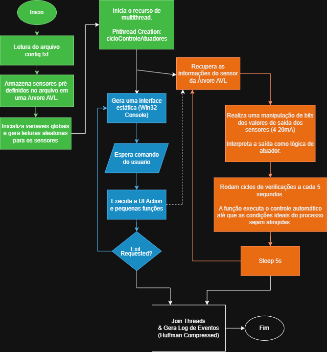

# ⚡ ILC-Simulator (Industrial Logic Core)

**ILC-Simulator** não é um projeto acadêmico; é um motor de lógica industrial de baixo nível projetado para emular o comportamento de um **PLC (Programmable Logic Controller)** real. O foco principal é demonstrar alta competência em linguagem C, estruturas de dados complexas e sistemas concorrentes aplicados à automação.

O projeto simula a jornada física do dado: desde a leitura de corrente (mA) de um sensor simulado, passando por um processo de conversão analógico-digital (ADC), até a manipulação de registradores de 32 bits para o acionamento de atuadores via lógica de bits (*bitwise*).

---

## 🏗️ Arquitetura e Decisões de Projeto

O sistema foi desenhado para ser eficiente, robusto e escalável, utilizando conceitos fundamentais de Ciência da Computação:

### 1. Fluxo de Execução (IHM vs. Controle)
<p align="center">
  
</p>
*(O diagrama acima detalha a separação entre as threads de interface e a lógica de scan do PLC)*

### 2. Gestão de Dados com Árvore AVL
Embora existam formas mais simples de armazenar sensores, a implementação de uma **Árvore AVL** foi uma decisão estratégica para demonstrar domínio em estruturas balanceadas. 
- **Performance**: Garante que a busca, inserção e remoção de qualquer dispositivo ocorra em tempo logarítmico $O(\log n)$.
- **Escalabilidade**: Mantém a estabilidade do sistema de automação independente da quantidade de sensores no barramento.

### 3. Configuração via Arquivos (I/O)
Para evitar o setup manual e repetitivo, o simulador utiliza **leitura de arquivos de configuração externos**. Isso não apenas acelera os testes, mas reflete uma prática real de mercado, onde parâmetros de hardware são carregados via arquivos `.txt` ou `.conf` durante o boot do sistema.

### 4. Assincronismo com Multithreading (Pthreads)
Para garantir que o simulador nunca pare de processar a lógica industrial enquanto aguarda comandos do usuário no terminal, utilizei a biblioteca **POSIX Threads**:
- **Control Thread (PLC)**: Executa o ciclo de varredura (*Scan Cycle*) de forma ininterrupta em background.
- **IHM Thread (UI)**: Gerencia a interação com o operador sem causar "lag" ou interrupções na lógica de controle.

---

## 🚀 Roadmap de Evolução

O ILC-Simulator é um projeto "vivo" e passará pelas seguintes implementações:

* **Log de Eventos**: Registro histórico de todas as decisões tomadas pelo controlador.
* **Compressão de Dados (Huffman)**: Para demonstrar domínio em algoritmos de compressão, os arquivos de log serão compactados utilizando a codificação de Huffman.
* **Refatoração para Clean Code**: Revisão profunda da arquitetura para garantir que o projeto seja um exemplo de legibilidade e manutenibilidade.
* **Evolução da Interface**: Transição do terminal para uma interface visual mais próxima de sistemas SCADA modernos.

---

## 🛠️ Instalação e Execução

### Pré-requisitos
* Compilador **GCC** (MinGW recomendado para usuários Windows).
* Suporte a **pthreads** (nativo no MinGW).

### Passo a Passo
1.  **Clone o repositório:**
    ```bash
    git clone [https://github.com/DaviReder/ilc-simulator.git](https://github.com/DaviReder/ilc-simulator.git)
    cd ilc_simulator
    ```
2.  **Compile o projeto:**
    ```bash
    gcc main.c src/*.c -I include -lpthread -o ilc_simulator
    ```
3.  **Execute o simulador:**
    ```bash
    ./ilc_simulator
    ```

---

## 🎓 Sobre o Autor

Desenvolvido por **Davi**, estudante de Engenharia de Controle e Automação e Ciência da Computação. Este projeto é a intersecção entre o rigor da engenharia de hardware e a otimização de software de alto desempenho.

---
