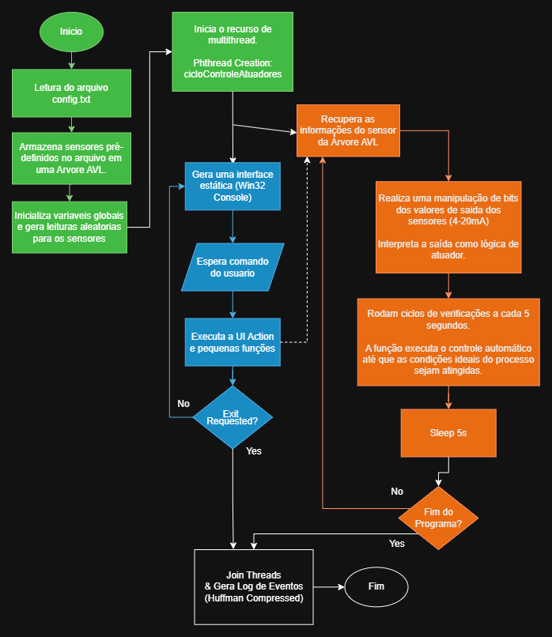

# SoftPLC (Simulador de PLC)

**Simulador de PLC** é um núcleo de processamento lógico de baixo nível desenvolvido em C, projetado para emular o comportamento rigoroso de um **SoftPLC (Software Programmable Logic Controller)**.  O foco principal é demonstrar alta competência em linguagem C, estruturas de dados complexas e sistemas concorrentes aplicados à automação.

Este projeto não é apenas uma simulação de variáveis; é um motor que traduz a jornada física do dado: desde a leitura de corrente (**4-20mA**) de sensores simulados, passando por uma conversão Analógico-Digital (ADC), até a manipulação de registradores de 32 bits para o acionamento de atuadores via lógica de bits **(*bitwise*)**.

---

<p align="center">
  
  <br>
  <em>O diagrama acima detalha a separação entre as threads de interface e a lógica de scan do PLC</em>
</p>

---

###  Tecnologias e Arquitetura

*   📜 **Log de Eventos & Huffman:** Registro histórico de todas as decisões tomadas pelo controlador e sua compressão ao atingir 100kb com o algoritmo de Huffman.
*   🔄 **Ciclo de Scan Industrial (Scan Cycle):** Execução ininterrupta da lógica de controle em malha fechada, com leitura de entradas, processamento de interrupções e atualização de saídas.
*   🌳 **Árvore AVL**: Utilização de uma **Árvore AVL** balanceada para registro e busca de sensores/atuadores, garantindo tempos de resposta constantes.
*   🔢 **Lógica Bitwise Multivariável**: Processamento de decisões através de registradores de 32 bits, permitindo que múltiplos atuadores respondam simultaneamente a diferentes condições de sensores.
*   🧵 **Operação Multithreading**: Separação total entre a camada de controle (Kernel) e a camada de visualização (IHM) através de Mutexes e POSIX Threads, evitando o bloqueio do processamento industrial por interrupções de usuário.
*   🖥️ **Interface estática:** Ao receber informações continua impriminto a mesma interface, facilitando perceber as alterações nos valores com o tempo.

---

### Análise Crítica e Limitações Arquiteturais

Como este projeto possui um caráter fortemente acadêmico e focado no domínio prático de estruturas de dados, foram feitos alguns *trade-offs* de design que, em um ambiente de produção real, seriam abordados de forma diferente:

#### 1. Concorrência e Gargalo de I/O de Tela
Na camada de interface (`main.c`), as funções de exibição em tela (`printf`) ocorrem dentro da região crítica protegida pelo Mutex da árvore AVL. Em sistemas de automação de tempo real (RTOS), operações de I/O em tela são lentas e bloqueantes, o que introduziria um *jitter* inaceitável no ciclo de scan do PLC. Uma abordagem comercial exigiria técnicas de *Double-Buffering*, onde os dados da AVL são copiados rapidamente para uma estrutura espelho em RAM, liberando o Mutex antes de iniciar a renderização gráfica.

#### 2. Escolha de Estrutura de Dados (Árvore AVL vs. Arrays Estáticos)
O uso de uma Árvore AVL para indexar os sensores foi uma decisão puramente didática para demonstrar o controle de algoritmos auto-balanceáveis em C puro. Em um PLC real, o número de canais de I/O é fixo e conhecido em tempo de compilação. O uso de alocação dinâmica (`malloc`) em sistemas críticos é evitado devido ao risco de fragmentação de memória e imprevisibilidade de tempo execução. Para produção, a estrutura ideal seria um array estático ou tabela hash direta (O(1)).

#### 3. Acoplamento e Portabilidade de Sistema Operacional
O projeto apresenta uma arquitetura híbrida de dependências, utilizando a API nativa de Console do Windows para controle de terminal e a biblioteca POSIX (Através do MinGW pthreads) para o gerenciamento de concorrência. Para garantir portabilidade multiplataforma (Linux/macOS), a camada gráfica e de threads deveria ser isolada em uma Camada de Abstração de Sistema Operacional (OSAL) usando diretivas de compilação condicional (`#ifdef _WIN32`).

---

### Roadmap & Futuras Melhorias

Melhorias lineares que sugiro ao projeto:
Melhorias de engenharia planejadas para o projeto:
*   **PID Controller:** Implementação de um algoritmo de controle Proporcional-Integral-Derivativo discreto para substituir a lógica atual baseada em histerese.
*   **Comunicação via Sockets:** Evolução do motor do PLC para escutar e responder requisições de rede através de sockets TCP/UDP, emulando o comportamento de um protocolo industrial (como uma variante simplificada do Modbus TCP).
*   **Refatoração para Clean Code & Sanity Checks:** Varredura profunda do gerenciamento de memória usando ferramentas de análise dinâmica (como *Valgrind* ou *Dr. Memory*) para assegurar a completa ausência de vazamentos de memória (*memory leaks*).

---

### Instalação e Execução

#### Pré-requisitos
* Compilador **GCC** (MinGW recomendado para usuários Windows).
* Suporte a **pthreads** (nativo no MinGW).
* Testado no Windows 10.

#### Passo a Passo
1.  **Clone o repositório:**
    ```bash
    git clone https://github.com/DaviReder/softplc.git
    cd softplc
    ```
2.  **Compile o projeto:**
    ```bash
    gcc main.c src/*.c -I include -lpthread -o softplc
    ```
3.  **Execute o simulador:**
    ```bash
    ./softplc
    ```

---

> 🎓 Sobre o autor: Estudante da PUC/MG.

> Este projeto é a intersecção entre o rigor da engenharia de hardware e a otimização de software de alto desempenho. Seu intuito é puramente didático, servindo como base para fortificar o aprendizado em estruturas de dados complexas e otimização de software. Sinta-se à vontade para explorar e sugerir melhorias!